# Operation Duckboat

This is readme for operation duckboat, project that contains 3d-printed, remote controlled boat and controller. This document is for boat, you can find controller repo at . Both uses esp32u-boards and esp-now -protocol for communication. At the moment of writing this it is not proved how duckboat survives its itended use, being a ferry that pushes ducks from water when waterfowling. If you have great dog, maybe you should use that for hunting instead of duckboat. But duckboat can also be great project and lots of fun even without hunting if you like remote controlled things. 

I used 7.4v batteries and brushless 3650 kv4370 -motors which gives maybe total of one horsepower and it is fast enough for me. If you want to tune up, maybe you can use 11.1v batteries which can double the output. This requires mods in boat battery voltage measurement voltage divider and code, you have to drop voltage to safe level for esp32 analogread input. Also you should tune LM2596 -buck converter output voltage to 5 volt for esp32. In voltage divider i used 2*10K -resistors on top and one 10K at bottom which gives 2800 millivolts to esp32 input when charged to max of 8.4 volts, you should not exceed 3300mv. 

I think that my motor kv-rating is maybe bit too much, 4370*8.4 volts when charged gives max rpm of 36708 and i already blew plastic oem jet propeller. Because of this i printed heavy duty propeller which seems to withstand high rpm better, you can find this in stl-files. Propeller is made for 4mm shaft and outer diameter is 26mm. After printing propeller you should sand all imperfections for smooth surface, and also trim outer diameter that you have some clearance between propeller and housing to prevent contact at high rpm. If you have problems like motor loses thrust at high rpm, that propably means that you need smoother surface in propeller and sharp edge on front that cuts water cleanly. Uneven surface can cause "i-cant-understand" -problems at full thrust. 

I had problems with jets also because my balance was front-heavy. After printing rear nozzles and making balance rear-heavy problems were solved. If water outlet is on top of water level, even for a little while, air will flow to propeller inlet and thrust is gone. Problem can still occur when reverse, though. So balance your boat and install your parts so that outlets stays under water.

Tune your both esc to "bidirectional" to handle reverse. I used esc_config_tool 1.93 (https://am32.ca/downloads). 

I printed hull using PETG-filament but this can be made of large variety of materials. I printed whole hull at once using Anycubic Chiron but maybe it is safer if you split model in pieces in your slicer.

Parts list:
-	esp32u
-	6dbi external antenna with 15cm cord
-	LM2596 buck converter
-	6 * 10K resistors
-	2 * 3650 brushless motors, 4370kv
-	2 * 26mm water jet thrusters
-	2 * am32 esc
-	2 * 7.4 volt 6000mAh rc-batteries
- 	4 * xt90-connectors
-	2 * 100 amp manual circuit breakers (as main switches)
-	2 * 60 amp automatic reset circuit breakers
-	6mm^2 electric wire, 1.5mm^2 for smaller lines and small solid copper lines between esp/lm2596 pins.
    Check wiring at https://app.cirkitdesigner.com/project/83c7dbe5-4580-4fe7-96a1-f2cac5960db9
-	arduino plastic case for esp32/LM2596
-	low amperage blade fuse for esp32 feed
-	spring for cover push button (7mm diameter)
-	screws and zip ties
-	piece of copper plate for antenna mount (melted/pushed in place using soldering pen)
- 	small hose and plastic tubing for motor cooling
-	styrofoam (I filled whole lower part of boat, and also controller carrier when driving. This gives total of ~2.7 liters of volume which should float 2.7 kg. My boat weighs 3.7 kg, hopefully it does not leak much.)
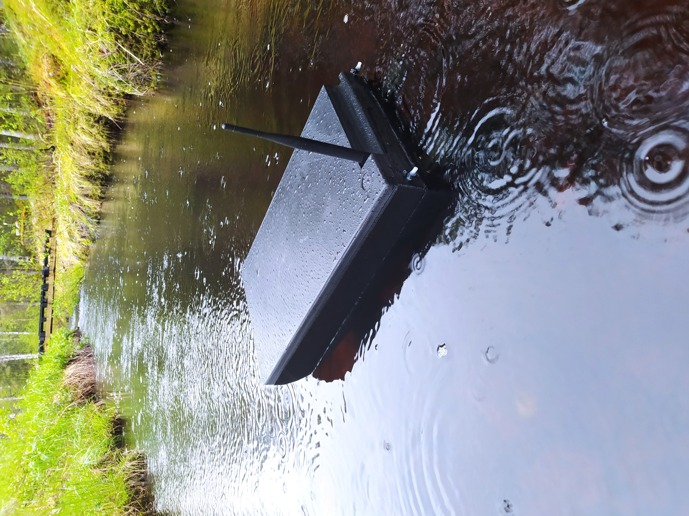
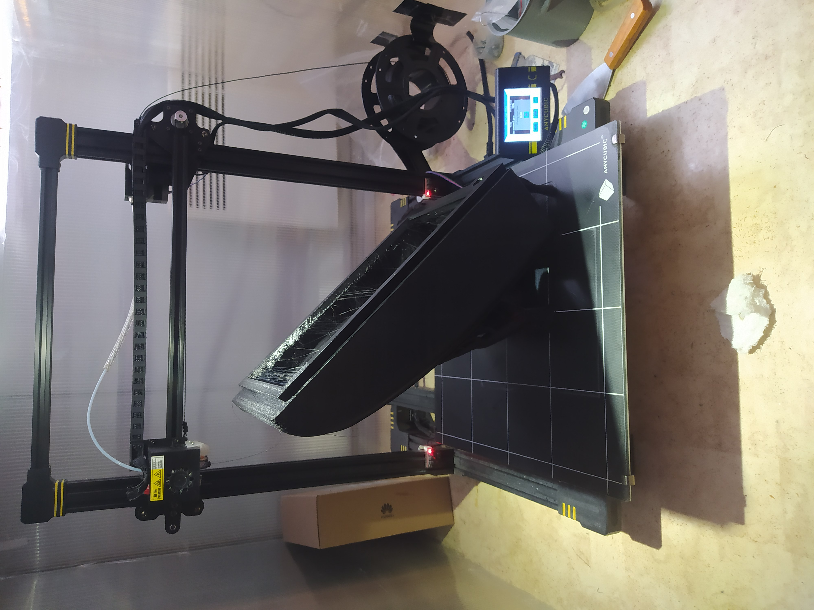
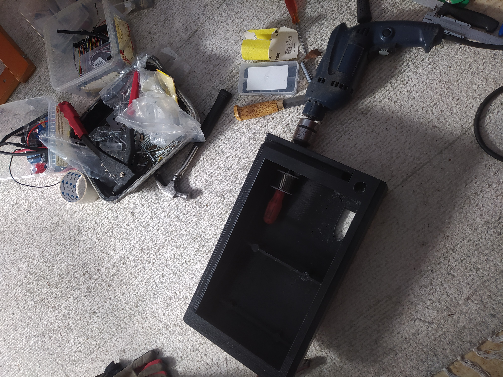
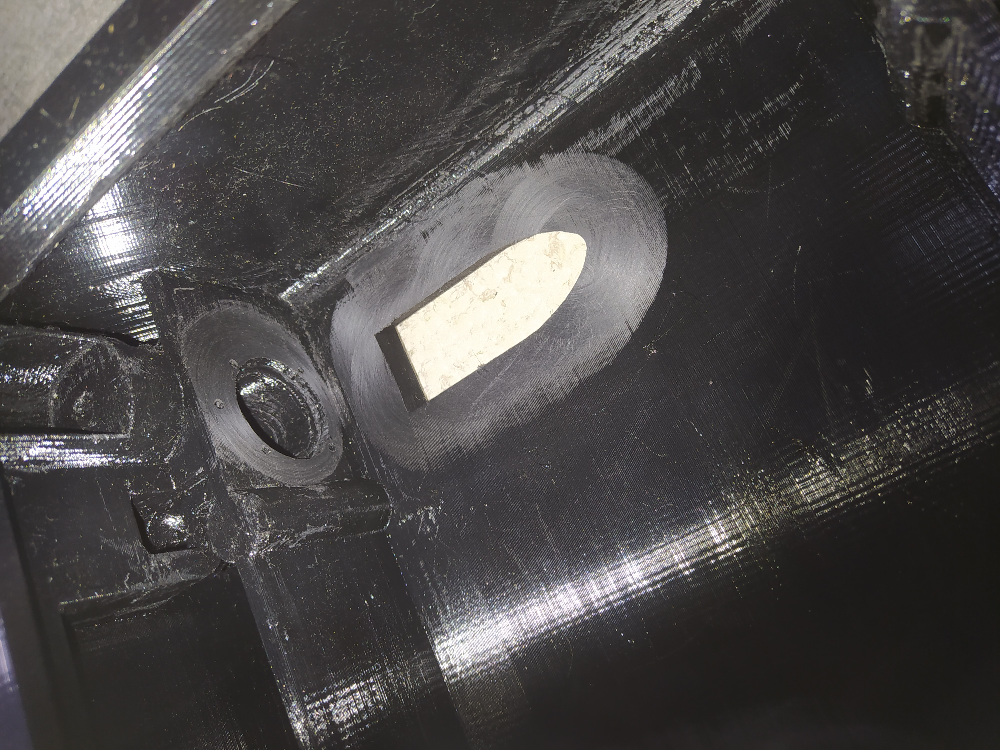
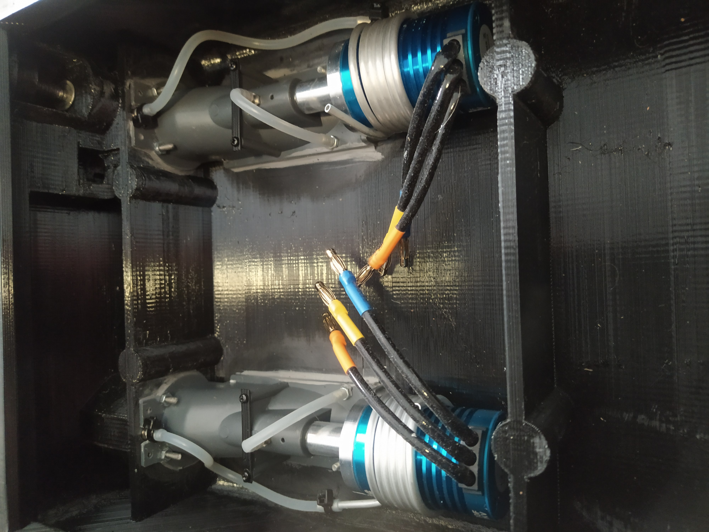
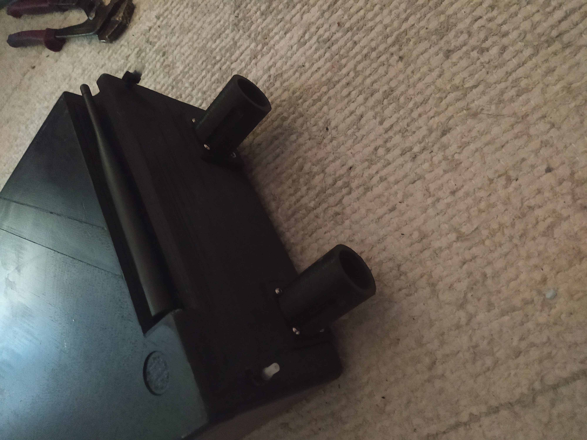
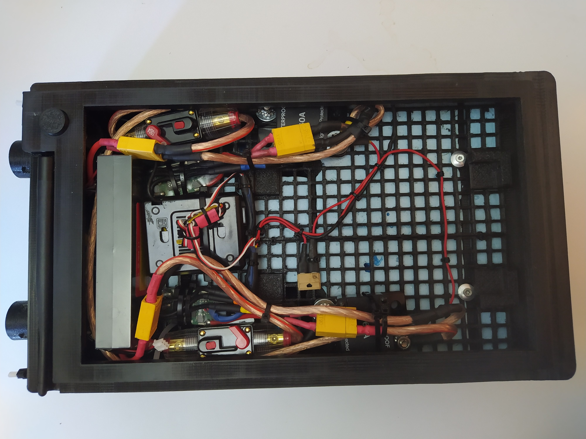
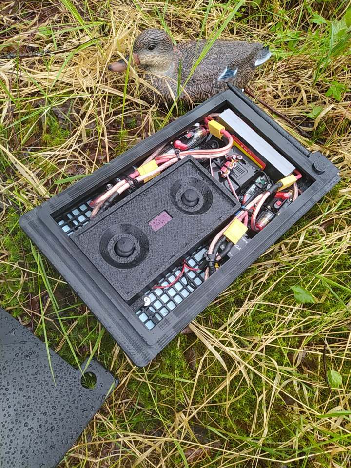
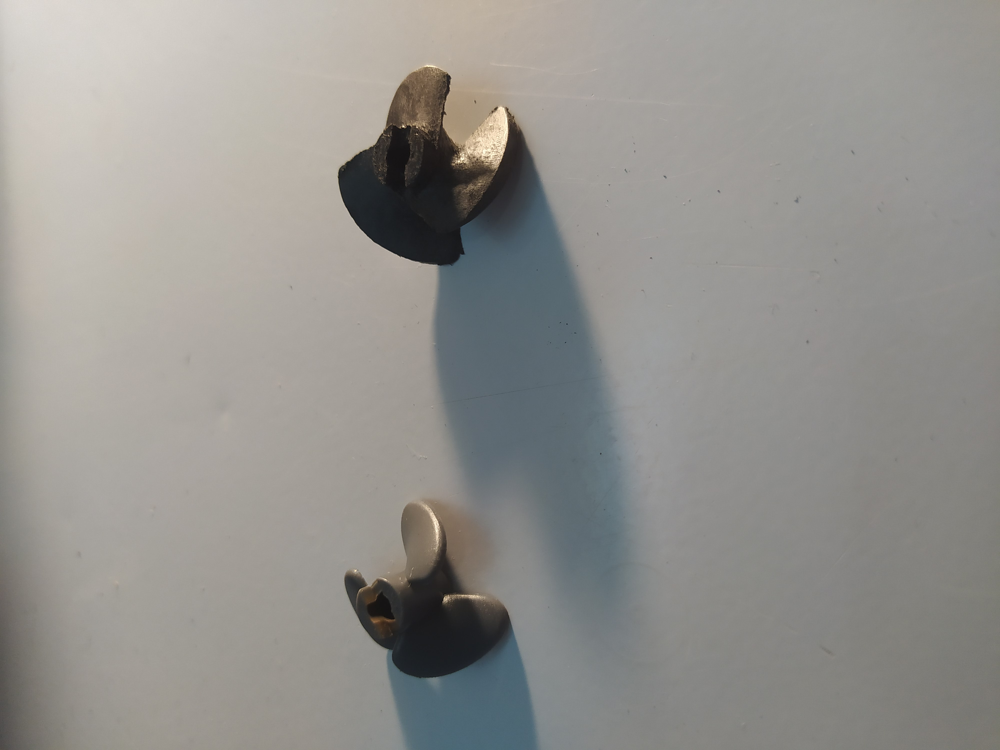
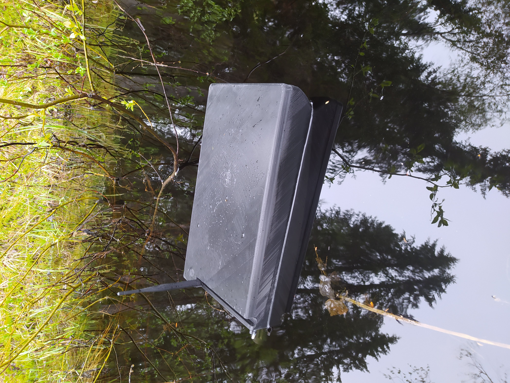
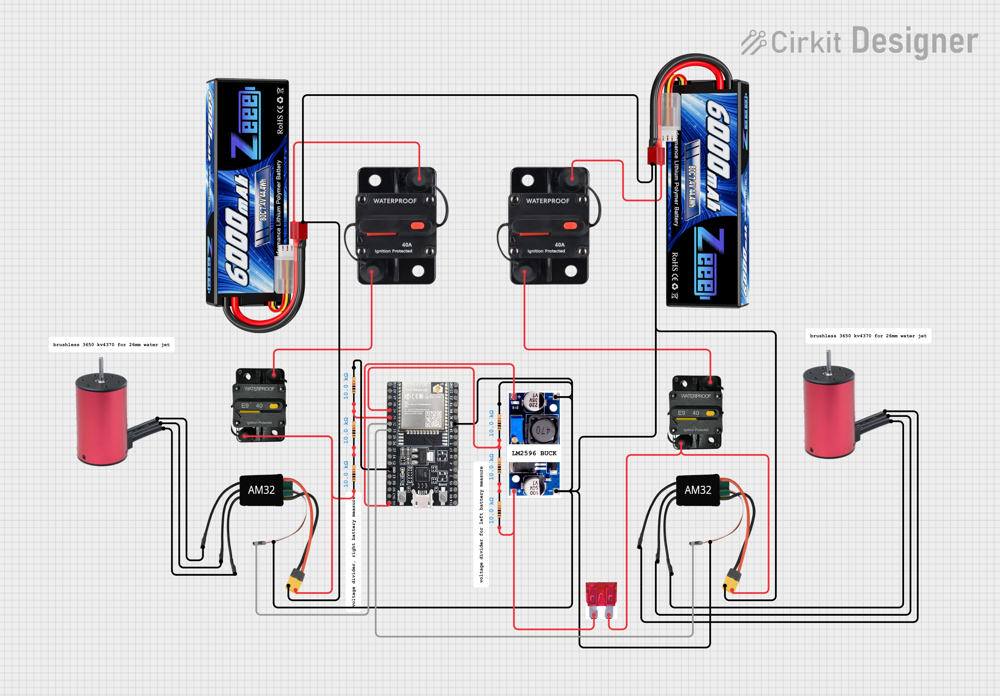
